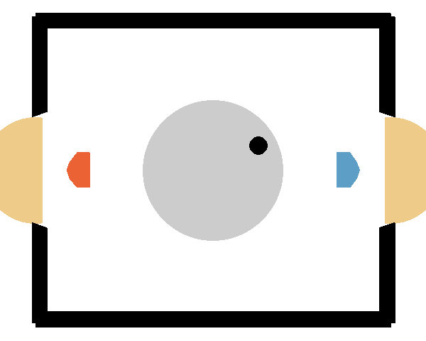

## QR-SAC on Hockey Environment

*QR-SAC (red) vs strong opponent (blue)*

Here you can see the agent from checkpoint checkpoint_hockey_vs_4_all_rew_ep_90000_qr_sac_runx from [checkpoints](./checkpoints/) that also competes in the tournament as fast_and_FOURIERous_QR-SAC. In [run_info](./run_info/) you can find notes, the log file and the arguments/hyperparamter for each training run.  