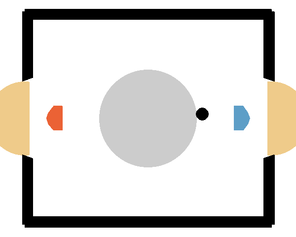

## plain SAC on Hockey environment

  
*SAC (red) vs strong opponent (blue)*

Here you can see the agent from checkpoint sac_strong from [old_models](./old_models/). In [run_info](./run_info/) you can find notes, the log file and the arguments/hyperparamter for each training run.

remarks: 
- in folder [runs](./runs/), the tensorboard statistics about the runs cannot be provided due to uploading limits, but the most important information can bo found in the other files. 
- to be able to compare to QR-SAC in [test.py](./test.py), the [qrsac.py](./qrsac.py) and [qrmodel.py](./qrmodel.py) is added 