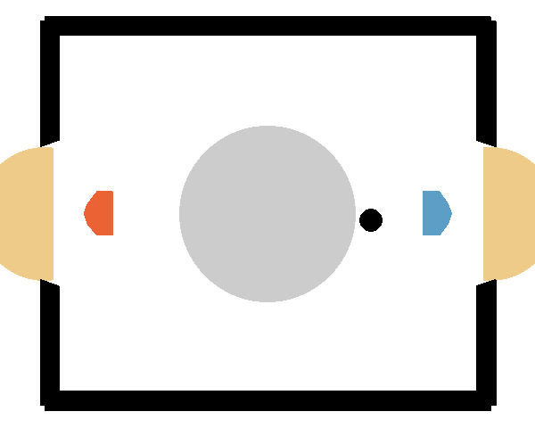

## QR-SimBa on Hockey Environment

*QR-SimBa (red) vs strong opponent (blue)*

Here you can see the agent from checkpoint SAC_23600_auto from [checkpoints](./checkpoints/). 
In [run_info](./run_info/) you can find notes, the log file and the arguments/hyperparamter for each training run.  
